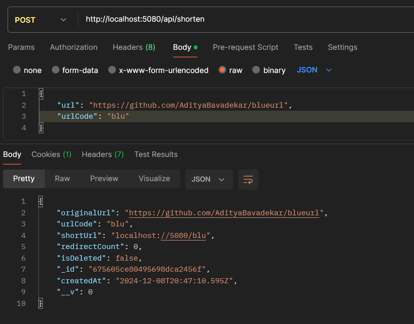
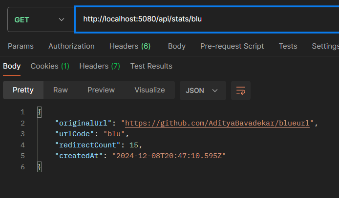
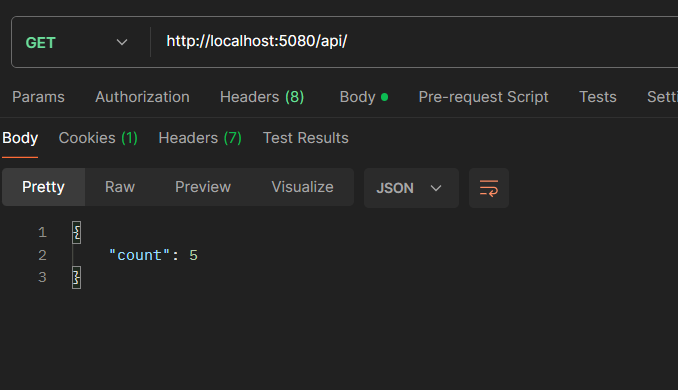
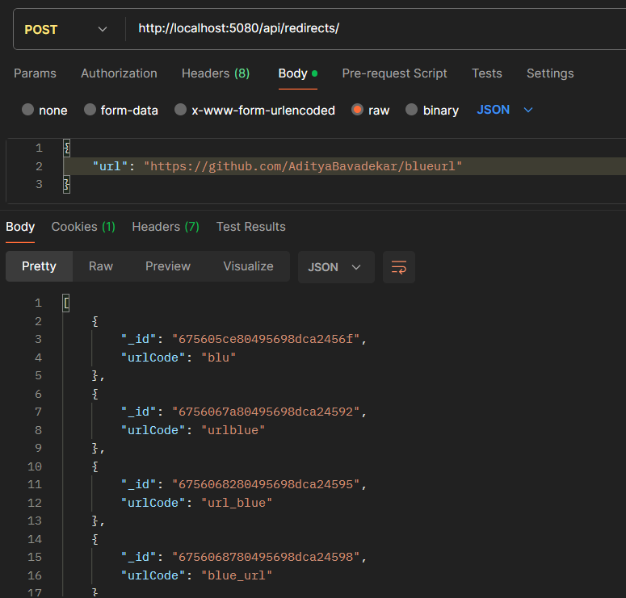

# blueurl
Just another URL Shortner

## Examples

| Redirects | Shorturl | urlCode |
| --------- | -------- | -------- |
| Codeforces Ratings System | https://blueurl.vercel.app/cf-ratings | `cf-ratings` |
| Interstellar (Main Theme) - Spotify | https://blueurl.vercel.app/interstellar | `interstellar` |
| My Github Profile | https://blueurl.vercel.app/adi.me | `adi.me` |
| This repo | https://blueurl.vercel.app/blu | `blu` |

- ℹ️ For stats about the shortened url add `/api/stats/` before the urlCode.

## Live API
- Visit : [`https://blueurl.vercel.app/`](https://blueurl.vercel.app/)

## Screenshots

| Screenshots | Screenshots |
|--------------|--------------|
|  |  |
|  |  |
|  |  |
